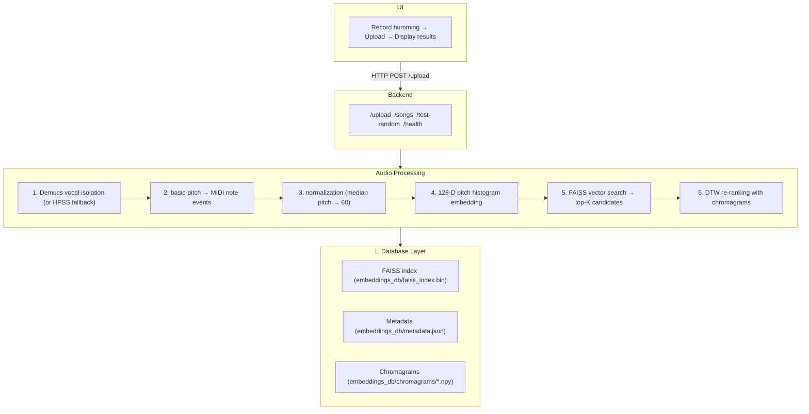

# Humming Detection System (Like Shazam, but for Humming)


A music recognition system that identifies songs from humming, singing, or audio samples using a hybrid pipeline: basic-pitch for MIDI extraction, 128-dimensional pitch histogram embeddings, FAISS vector search, and DTW re-ranking.

### Quick Start

```bash
# 1. Install dependencies
pip install -r requirements.txt

# 2. Build your fav database ( make sure you have some songs in the songs/ folder)
python build_database.py

python app.py

# Start the application
cd frontend
npm install
npm start
```

Open http://localhost:3000 and start humming!

### Architecture



## The Problem

Shazam works by comparing spectrograms directly, but this doesn't work for humming because:
1. **Frequency shift** - our hums in different keys than the original song
2. **Tempo variation** - Humming speed varies significantly
3. **Timbre difference** - Human voice vs. instruments produce very different spectra

##  Solution: Hybrid Pipeline

A multi-stage approach:

### Stage 1: Vector Search (Fast)
- **Demucs** isolates vocals from songs (or HPSS for humming input)
- **basic-pitch** extracts MIDI notes from audio
- **Normalization** shifts all pitches so median = 60 (C4)
- **128-D histogram** represents pitch occurrence frequency
- **FAISS IndexFlatIP** performs sub-millisecond cosine similarity search

### Stage 2: DTW Re-ranking 
- Top candidates from FAISS are re-ranked using **Dynamic Time Warping**
- **Chromagram-based** matching handles tempo variations
- **12-semitone shift search** provides key invariance
- **Stretch penalty** filters out unrealistic tempo matches

### Features Used

| Feature                     | Purpose                        | Stage    |
| --------------------------- | ------------------------------ | -------- |
| **Pitch Histogram (128-D)** | Fast vector search             | FAISS    |
| **Chromagram (12 × T)**     | DTW re-ranking                 | Re-rank  |
| **Key Normalization**       | Handle different singing keys  | Both     |
| **Demucs Vocals**           | Remove instruments from songs  | Build DB |
| **HPSS**                    | Remove percussion from humming | Query    |


##  Setup

### 1. Install Python Dependencies

```bash
# Create virtual environment (recommended)
python -m venv venv
venv\Scripts\activate  # Windows
# source venv/bin/activate  # Linux/Mac

# Install dependencies
pip install -r requirements.txt
```

### 2. Install Demucs (Recommended for best quality)

```bash
pip install demucs
```

Demucs will automatically download the model (~300MB) on first use.

### 3. Add Songs to Database

Place your audio files in the `songs/` folder. Supported formats:
- `.mp3`, `.wav`, `.flac`, `.m4a`, `.ogg`, `.webm`

For best results, name files as: `Artist - Title.mp3`

### 4. Build the Database

```bash
# With Demucs vocal isolation (recommended, but slower)
python build_database.py

# Without Demucs (faster)
python build_database.py --no-demucs

# Force rebuild existing database
python build_database.py --force
```

### 5. Start the Backend

```bash
python app.py
```

The server starts at http://localhost:5000

### 6. Start the Frontend

```bash
cd frontend
npm install
npm start
```

The UI @ http://localhost:3000

### Speed

- **FAISS search**: < 1ms for 1000 songs
- **basic-pitch inference**: ~2-5 seconds
- **DTW re-ranking**: ~100ms per candidate
- **Total query time**: ~3-8 seconds

##  for Better Results

1. **Hum clearly** - Avoid background noise
2. **Keep tempo consistent** - Don't speed up/slow down dramatically
3. **Hum the melody** - Not the rhythm or drums
4. **5-10 seconds** is ideal for web recording
5. **Add more songs** - Larger database = better discrimination
6. **Use Demucs** for database building for cleaner vocal extraction
##  Algorithm Details

### Pitch Histogram Embedding

The 128-dimensional embedding represents MIDI pitch occurrences:
1. **basic-pitch** extracts MIDI note events (pitch, duration, amplitude)
2. Each pitch (0-127) gets a weighted count: `duration × amplitude`
3. **Key normalization** shifts pitches so median = 60
4. **L2 normalization** enables cosine similarity via inner product

### DTW Re-ranking

```
For each FAISS candidate:
    Load chromagram from database
    For each pitch shift (0-11 semitones):
        Compute subsequence DTW distance (cosine metric)
        Track best match
    Apply tempo stretch penalty
    Return normalized distance
```

### Confidence Scoring (DTW)

```
Score < 0.10  → VERY HIGH confidence
Score < 0.15  → HIGH confidence
Score < 0.18  → MEDIUM confidence (threshold for "match")
Score >= 0.18 → NO MATCH
```

## Future Work: Deep Learning Integration

We plan to explore a deep learning approach using **Convolutional Neural Networks (CNNs) & Recurrent Neural Networks (RNNs)** or Transfer Learning strategies to improve robustness.

### Proposed Models
- **PANNs (Pre-trained Audio Neural Networks)**: Specifically the `Cnn14` model.
- **VGGish**: Google's audio feature extractor.

### Potential Workflow
1. Convert audio to **Log-Mel Spectrogram ( or similar features )**.
2. Pass through a pre-trained CNN to extract high-level features.
3. Train a **Siamese Network** with Triplet Loss to map humming and original songs to the same metric space (Metric Learning).

### Challenges to Address
While Deep Learning is powerful, adapting it for humming recognition involves solving:

- **Pitch Invariance**: Neural networks must remain still regardless of the input key (absolute pitch).
  
- **Timbre Independence**: The model must learn to ignore the texture difference between a human voice and instruments.

- **Data Requirements**: Training such a model requires a massive dataset of paired hums and songs, whereas our current algorithmic approach works with zero training data.
- 
### Proposed Datasets & Solutions
To address the data and robustness challenges outlined above, we will utilize the following resources and strategies:

- Primary Dataset (CHAD): We will use the Covers and Hummings Aligned Dataset (CHAD), which provides aligned pairs of original recordings and human humming, specifically designed for metric learning tasks.

- Benchmark Dataset: We will validate performance using the MIR-QbSH corpus.

#### Data Augmentation Strategy:

- Pitch Shifting: We will generate multiple variants of training samples (shifting ±1 and ±2 semitones) to force the model to learn relative pitch intervals rather than absolute frequencies.

- Vocal Synthesis: To solve data scarcity, we will generate synthetic "hums" from MIDI files using tools like Synthesizer V, helping the model learn to bridge the gap between instrumental and vocal timbres.